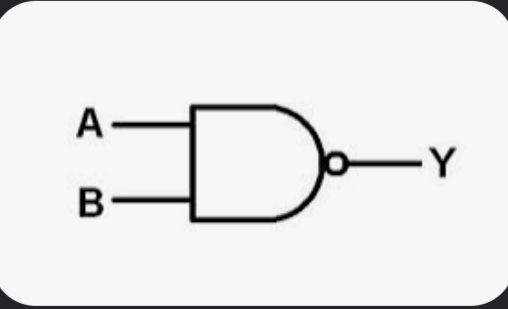
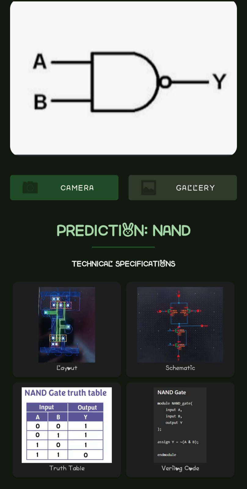

# LogicGateRecognizer

## Overview

LogicGateRecognizer is an AI-powered Android application that automatically identifies digital logic gates from images using TensorFlow Lite and Computer Vision. The application allows users to capture or upload an image of a logic gate and instantly view its classification along with detailed technical information.

## Features

* Image-based logic gate recognition
* Camera and Gallery support
* TensorFlow Lite model deployment on Android
* Classification of seven fundamental logic gates:

  * AND
  * OR
  * NOT
  * NAND
  * NOR
  * XOR
  * XNOR
* Displays gate-specific information:

  * Layout Diagram
  * Circuit Schematic
  * Truth Table
  * Verilog Code
* User-friendly Android interface
* Offline inference using TensorFlow Lite

## Project Architecture

1. User captures or selects a logic gate image.
2. The image is preprocessed and passed to a TensorFlow Lite model.
3. The model predicts the logic gate type.
4. The application displays:

   * Predicted Gate Name
   * Layout
   * Schematic
   * Truth Table
   * Verilog Implementation

## Technologies Used

* Android Studio
* Kotlin
* TensorFlow Lite
* Computer Vision
* Deep Learning
* Git & GitHub

## Dataset Classes

The model is trained to recognize the following logic gates:

* AND
* OR
* NOT
* NAND
* NOR
* XOR
* XNOR

## Application Screens

* Home Screen
* Camera Input
* Gallery Input
* Prediction Screen
* Layout Viewer
* Schematic Viewer
* Truth Table Viewer
* Verilog Code Viewer
## Application Results

### NOR Gate Detection

| Input Image                 |
| --------------------------- | 
| |
| Prediction Result             |
| --------------------------- | 
 |
### Information Displayed After Detection

After successful classification, the application automatically displays:

* Layout Diagram
* Circuit Schematic
* Truth Table
* Verilog Code

### Workflow

Hand Drawn Logic Gate → Camera/Gallery Input → TensorFlow Lite Model → Gate Classification → Display Layout, Schematic, Truth Table and Verilog Code

## Future Enhancements

* Confidence Score Display
* Real-Time Camera Detection
* Voice-Based Gate Explanation
* Additional Digital Circuit Components
* Educational Learning Module

## Learning Outcomes

This project demonstrates practical implementation of:

* Digital Electronics
* Logic Gate Design
* Computer Vision
* Deep Learning Deployment
* Mobile Application Development
* TensorFlow Lite Integration

## Author

**Megha Talawar**

Electronics and Communication Engineering

## License

This project is developed for educational and research purposes.
